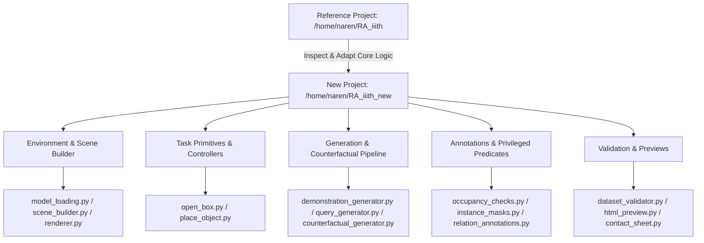

# MuJoCo Relational Precondition Benchmark & Smoke Pipeline Implementation Plan

This document outlines the architecture, component breakdown, data specification, and execution phases for creating an independent MuJoCo benchmark data-generation pipeline in `/home/naren/RA_iiith_new`.

## User Review Required

> [!IMPORTANT]
> - **Reference Project Non-Modification**: `/home/naren/RA_iiith` will be treated strictly as read-only context. All new code, minimal required assets, tests, configs, and generation scripts will live in `/home/naren/RA_iiith_new`.
> - **Execution Scope**: For this run, only the complete smoke profile (1-2 successful demo videos per task, matched PROCEED/STOP query pairs, counterfactuals, ground-truth masks/metadata, dataset validator, preview outputs) will be generated and verified. Full pilot dataset generation will not be run during this turn.
> - **Rendering & Dependencies**: System uses `/home/naren/miniconda3/bin/python` with `mujoco==3.10.0` and `MUJOCO_GL=egl` for offscreen rendering.

## Proposed Components & Architecture

### Component Overview

---

### [Component 1] Assets & Scene Foundation

#### [NEW] `assets/copied_assets/`
- Minimal XML base files: `kitchen_base.xml` and `object_library.xml`.
- Mesh files required for manipulation objects (coffee can, sugar box, mug, cup, bowl, spoon, fork, etc.).
- Defined placement surfaces: `B1_lid` surface for Task 1, `target_region` surface on countertop for Task 2.

#### [NEW] `src/environment/scene_builder.py`
- Dynamically loads base XML.
- Spawns robot (Fetch / Google Robot), box `B1`, target region, and manipulation objects.
- Supports placing objects on `B1_lid` (for Task 1 STOP/PROCEED) and in `target_region` (for Task 2 STOP/PROCEED).
- Implements settling physics steps (`mujoco.mj_step`) before rendering queries.

#### [NEW] `src/environment/renderer.py`
- Uses `mujoco.Renderer` with `MUJOCO_GL=egl`.
- Configurable camera resolution (default 640x480) and fixed camera angle (`front_camera`).
- Renders:
  1. RGB images (PNG for queries, MP4 for demonstration clips)
  2. Instance segmentation masks (mapping geom ID to instance ID)
  3. Culprit / blocker masks (binary mask for objects violating precondition)
  4. Target region / lid masks (surface region masks)

---

### [Component 2] Task Primitives & Execution

#### [NEW] `src/tasks/open_box.py`
- Implements successful `"Open the box."` execution.
- Grasps `B1_lid_handle_bar` using `BoxOpenExecutor` (adapted from reference project's `open_motion.py`).
- Follows hinge arc up to ~100 degrees open position.
- Records video from fixed `front_camera`.

#### [NEW] `src/tasks/place_object.py`
- Implements successful `"Place object1 in the target region."` execution.
- Picks `object1` from initial pick location using `PickExecutor` (adapted from `pick_motion.py`).
- Moves and places `object1` in the designated `target_region` using `PlaceExecutor` (adapted from `place_motion.py`).
- Records video from fixed `front_camera`.

---

### [Component 3] Deterministic Generation & Counterfactual Pairs

#### [NEW] `src/generation/scene_config.py`
- Configurable random seed management for deterministic scene reconstruction.
- Randomization parameters for object identities, distractor placements, background colors/textures.

#### [NEW] `src/generation/counterfactual_generator.py`
- **STOP Query Scene Generation**:
  - Task 1: Place 1 or 2 blocker objects on `B1_lid`.
  - Task 2: Place `object2` inside `target_region`.
- **Matched PROCEED Counterfactual Scene Generation**:
  - Clone STOP scene configuration (identical seed, background, camera, lighting, box/target pose, robot pose).
  - Apply minimal intervention:
    - Task 1: Move blocker object(s) from `B1_lid` to beside the box (`BESIDE(object, box)`).
    - Task 2: Move `object2` from `target_region` to beside the region (`OUTSIDE(object2, target_region)`).
- Rerender restored PROCEED scene and save pair links.

---

### [Component 4] Privileged Annotations & Validation

#### [NEW] `src/annotations/relation_annotations.py` & `src/validation/occupancy_checks.py`
- Evaluates privileged simulator state (object bounding box, contact points, relative Z height, surface footprint overlap).
- Task 1 Predicate: `ON_TOP_OF(blocker, box_lid)` vs `LID_CLEAR`.
- Task 2 Predicate: `OCCUPIES(object2, target_region)` vs `TARGET_AVAILABLE`.
- Generates precise pixel instance masks and culprit masks.

#### [NEW] `src/validation/dataset_validator.py`
- Verifies:
  1. All files in JSONL/CSV manifest exist.
  2. Video readability, frame count, FPS, and image resolutions.
  3. Strict label matching between intended state and privileged predicate check.
  4. Counterfactual pair symmetry (only culprit pose/relation changes, all non-causal variables identical).
  5. Culprit masks non-empty for STOP queries, lid/target masks valid.
  6. Data split holdout rules and background/object label balance.

---

### [Component 5] Previews & Verification Scripts

#### [NEW] `src/preview/html_preview.py` & `contact_sheet.py`
- Renders self-contained HTML page and image contact sheets displaying:
  - Task family & instruction
  - Decision label (PROCEED vs STOP)
  - RGB Query Image
  - Culprit mask overlay & Lid/Target mask overlay
  - Matched counterfactual pair side-by-side
  - Metadata and pair ID

#### [NEW] `scripts/run_smoke_test.sh`
- End-to-end master script executing:
  1. Demo generation for Task 1 & Task 2.
  2. Query generation (PROCEED & STOP matched pairs) under `smoke.yaml`.
  3. Validation check via `validate_dataset.py`.
  4. Preview generation via `preview_dataset.py`.
  5. Unit tests execution.

---

## Verification Plan

### Automated Tests (`tests/`)
- `test_seed_reproducibility.py`: Verify that identical seeds reproduce identical RGB images and simulator poses.
- `test_lid_occupancy.py`: Test privileged occupancy predicate on lid-clear vs lid-occupied scenes.
- `test_target_occupancy.py`: Test privileged occupancy predicate on target-empty vs target-occupied scenes.
- `test_counterfactual_pairs.py`: Test that matched counterfactual pairs differ strictly in culprit object position.
- `test_metadata_schema.py`: Validate output JSON manifest schema and completeness.

### End-to-End Smoke Test Execution
- Run `bash scripts/run_smoke_test.sh`.
- Inspect generated videos under `data/demos/`, query images and masks under `data/queries/`, manifests under `data/manifests/`, and HTML preview under `data/previews/`.
- Ensure dataset validator exits with code 0 and reports full pass.
